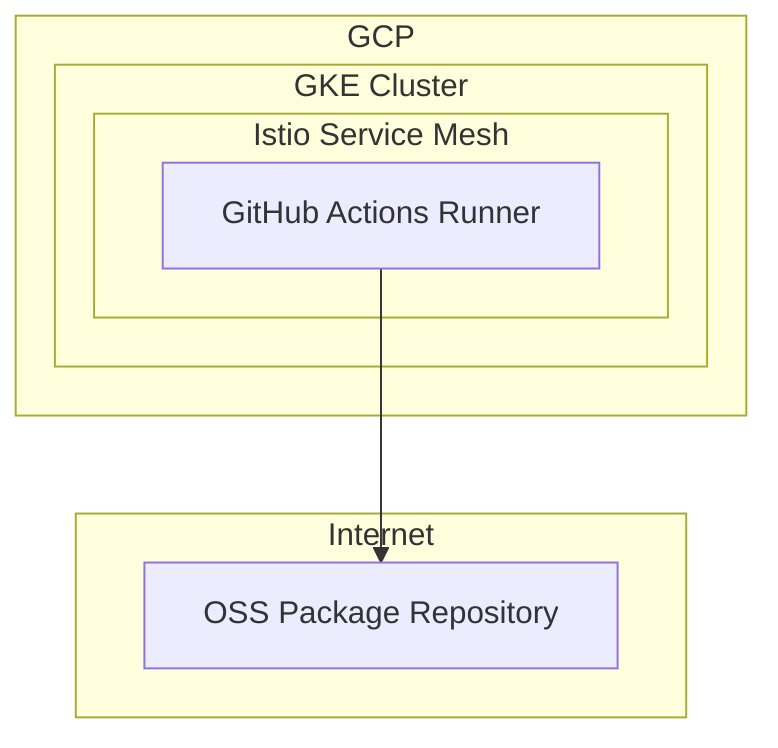
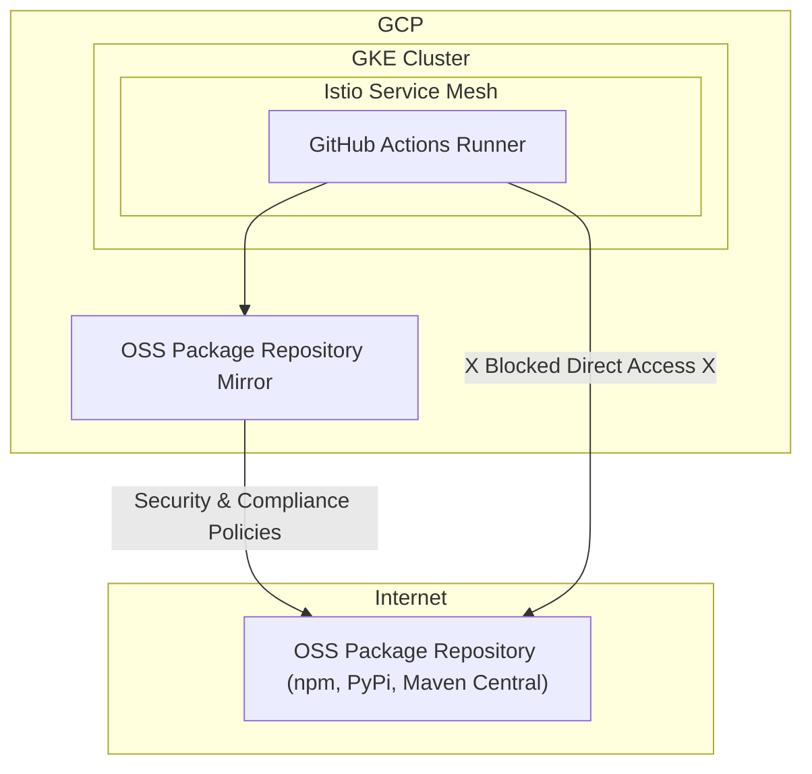

# Problem statement

Software supply chain security risks are a growing concern. GitHub Actions runners are running in an environment that allows workflows to source and install open source dependencies directly from public repositories like npm, yarn, PyPi, and Maven Central.

In order to reduce the risk of runner compromise through the installation of a malicious package, runners should be blocked from accessing these public repositories. This will force all workflows to instead source dependencies from internal mirrors that apply the desired security and compliance controls.

## Current architecture

## Desired architecture

In our desired architecture, we want to prevent runners from accessing public repositories and instead provide access to a controlled set of dependencies mirrored from those same sources.

## Solutions considered

Technologies we already have in place that could be used to apply this level of network egress control deserve our consideration: GCP Secure Web Proxy, Istio Egress Gateway, DNS-based filtering, VPC firewall rules and k8s Network Policies.

### GCP Secure Web Proxy

This is a dedicated, managed service from Google Cloud for filtering and securing egress web traffic.

#### How it works

We route outbound traffic from our GKE cluster through the Secure Web Proxy. We create fine-grained policies that only allow traffic to our OSS package repository mirror and any other desirable destinations and block all other web traffic.

#### Key characteristics

*   **Fully Managed & Scalable:** As a managed service, it handles the underlying infrastructure, scaling, and maintenance, allowing us to focus on policy definition.
*   **Simplified Policy Management:** We can maintain a straightforward allowlist of destination URLs, blocking all other web traffic by default.
*   **Cost:** While there is an associated cost, it provides clear visibility into the volume of egress traffic from our runners.
*   **Complexity:** This approach offers a straightforward implementation with a relatively low configuration overhead.

### Istio Egress Gateway

We are already using Istio and are comfortable managing our cluster resources with `helm` so the egress gateway feels like a good fit.

#### How it works

We configure an [Istio Egress Gateway](https://istio.io/latest/docs/tasks/traffic-management/egress/egress-gateway/) and set the `outboundTrafficPolicy` to `REGISTRY_ONLY` ensuring the sidecars only allow traffic to destinations defined in the Istio service registry. Then, we create `ServiceEntry` resources for each domain in our allowlist.

#### Key characteristics

*   **Leverages Existing Infrastructure:** This solution utilizes our existing Istio service mesh, avoiding the introduction of new technologies.
*   **Kubernetes-Native:** Configuration is managed via Kubernetes custom resources (`ServiceEntry`, `VirtualService`, `AuthorizationPolicy`), which aligns with our existing GitOps workflows.
*   **Fine-grained Control:** We can specify which pods (by label) are allowed to access which external services, providing granular control over egress traffic.
*   **Management Overhead:** Maintaining a `ServiceEntry` for each allowed external service can increase configuration complexity.
*   **Security Consideration:** A compromised pod can bypass the Istio sidecar proxy and still access the network. For this reason, we must combine this approach with Kubernetes Network Policies that force all egress traffic through the egress gateway.

### DNS-based Filtering

This approach focuses on controlling which domain names can be successfully resolved from our runners. If `npm` can't resolve `registry.npmjs.org`, then it will be blocked from sourcing packages from it.

#### How it works

We use [GCP's Cloud DNS](https://cloud.google.com/dns/docs/overview) to create DNS policies for the cluster VPC. We create a response policy rule that returns  `NXDOMAIN` (non-existent domain) when clients in the VPC attempt to resolve undesirable public package repositories.

#### Key characteristics

*   **Broad Coverage:** Can easily block access to millions of known malicious or unwanted domains.
*   **Simple to Manage:** Infrastructure as Code (IaC) can be used to manage the configuration declaratively.
*   **Bypassable:** An attacker can often bypass DNS filtering by using hard-coded IP addresses in their malware or applications.

### VPC Firewall Rules

Firewall rules are a foundational aspect of the network security posture of our runner environment, so they deserve at least brief consideration.

#### How it works

We create egress firewall rules in the cluster's VPC that deny all outbound traffic on ports 80 and 443, except to the IP ranges of our package mirror.

#### Key characteristics

*  **Management Overhead:** This approach requires maintaining and updating a large number of IP-based rules, which can be brittle and difficult to manage at scale, especially with cloud-native services that have dynamic IP addresses.

### Kubernetes Network Policies

A Kubernetes-native way to control network traffic.

#### How it works

We create a `NetworkPolicy` that denies all egress traffic from runner pods by default. We add a rule to allow egress only to the internal IP of our Istio egress gateway.

#### Key characteristics

*   **Kubernetes-Native:** The use of Kubernetes-native resources allows for a declarative approach to network security that is consistent with existing workflows.
*   **Security:** Provides a strong layer of defense within the cluster, but is insufficient to completely control egress. Must be combined with our Istio egress gateway and/or VPC firewall rules.

## Solution Chosen: A Defense-in-Depth Approach

We have chosen to combine **Istio Egress Gateway** and **Kubernetes Network Policies** for a cloud-native, defense-in-depth approach that we can manage with `helm`.

This layered strategy provides a robust security posture. The Kubernetes Network Policy acts as the first line of defense, enforcing a baseline level of network isolation at the pod level. It ensures that all outbound traffic from the runner pods is directed to the Istio Egress Gateway, preventing any bypass attempts.

The Istio Egress Gateway then acts as the second line of defense, providing more granular, application-aware control over the egress traffic. It allows us to enforce policies based on the service identity and the destination URL, ensuring that the runners can only access the approved OSS package repository mirror.

While this approach requires a slightly more complex initial setup, the long-term benefits of a secure, maintainable, and cloud-native solution far outweigh the initial effort.

An example `helm` chart is [included here](/istio-network-policy-example/Chart.yaml) to illustrate the basic configuration.

## Conclusion

Securing the software supply chain is a critical aspect of modern software development. By blocking direct access to public open-source package repositories and enforcing the use of a secure internal mirror, we can significantly reduce the risk of a runner compromise.

The combination of Istio Egress Gateway and Kubernetes Network Policies provides a powerful and flexible solution for controlling egress traffic in a cloud-native environment. This defense-in-depth approach not only enhances security but also provides the visibility and control needed to confidently manage our software supply chain within the CI/CD environment.
